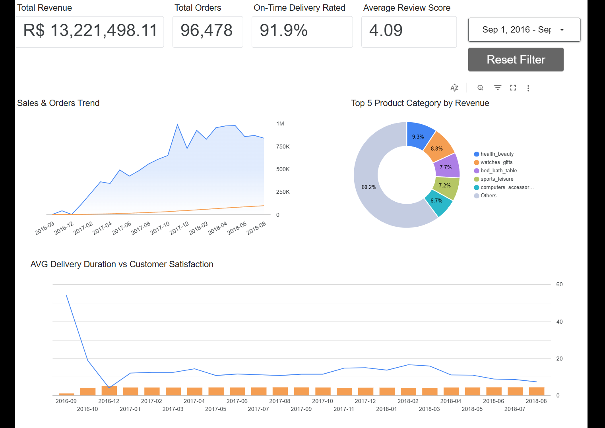
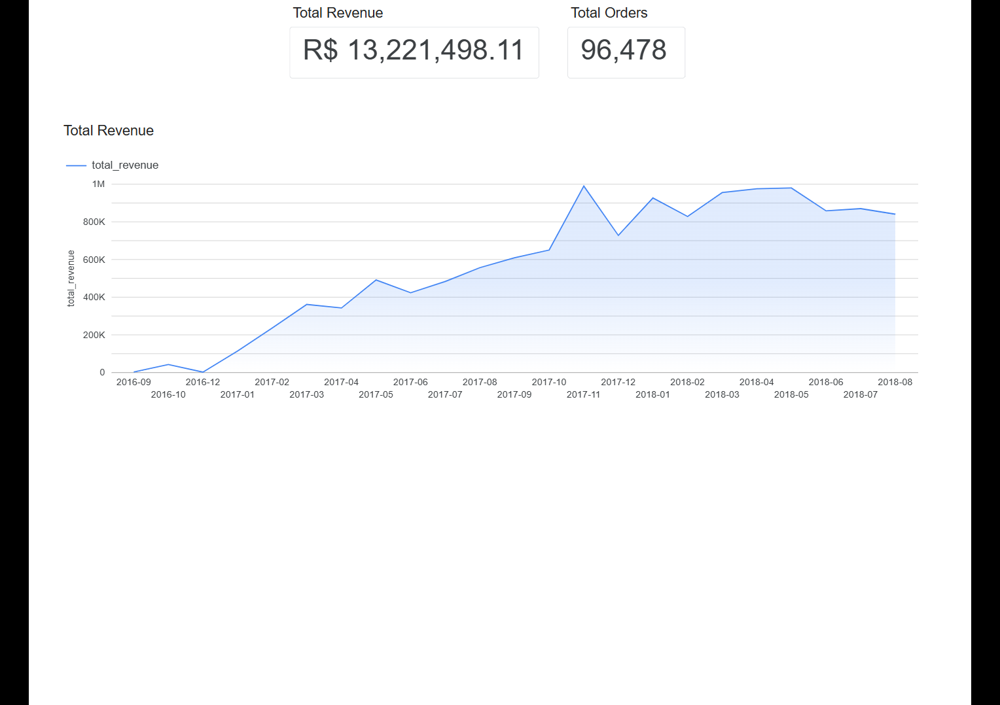
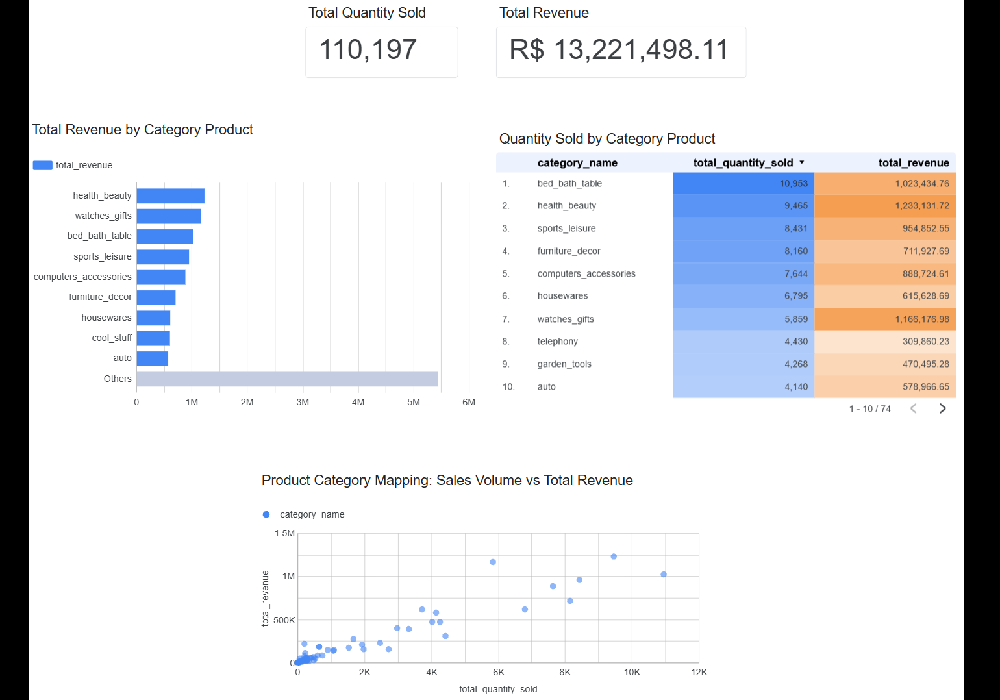
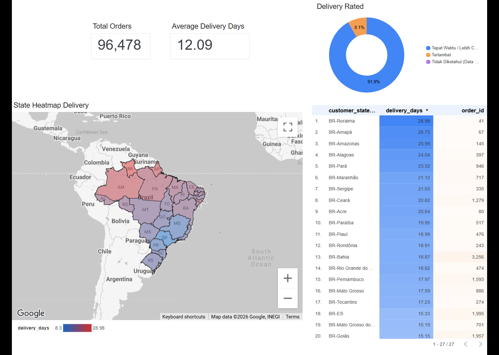
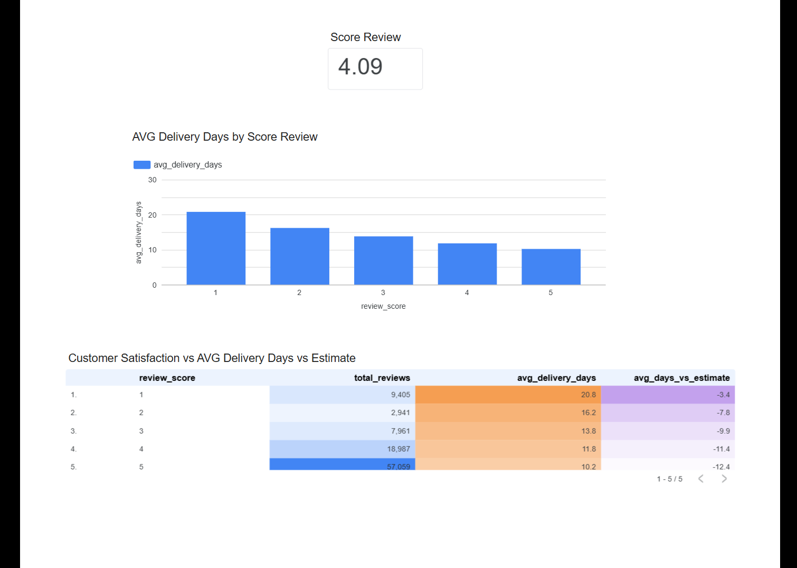

# olist-brazilian-ecommerce-analysis
SQL-based analysis, BigQuery, Looker (Google Data Studio)

# Olist E-Commerce End-to-End Business Performance Analytics

## 1. Latar Belakang Proyek
**Olist** adalah penyedia layanan pemasaran produk yang menghubungkan usaha kecil - menengah dari seluruh penjuru Brasil dengan saluran penjualan nasional. Dalam proyek analisis data ini, saya bertindak sebagai **Data Analyst** untuk mengevaluasi performa makro perusahaan berdasarkan dataset publik yang berisi **96.478 transaksi pesanan sukses (*delivered*)** sepanjang periode **September 2016 hingga September 2018**.

Proyek ini dibangun secara *end-to-end* mulai dari proses pengolahan data mentah (*Exploratory Data Analysis* & *Data Cleansing*) menggunakan **Google Cloud Platform (GCP) BigQuery (SQL Standard)** hingga visualisasi interaktif menggunakan **Looker Studio**.

-------

## 2. Pertanyaan Bisnis & Pembatasan Masalah (*Scope Limitation*)
Untuk memastikan analisa tetap fokus dan memberikan nilai bisnis yang nyata, ruang lingkup analisis dibatasi pada 4 pertanyaan utama:
1. **Tren Penjualan Bulanan**: Bagaimana pergerakan total pendapatan (*Total Revenue*) dan volume pesanan (*Total Orders*) Olist dari waktu ke waktu? Apakah terdapat indikasi musiman (*seasonality*)?
2. **Kategori Produk**: Kategori produk apa saja yang memberikan revenue terbesar (*Top 5 Product Category* ), dan seberapa besar kontribusi porsinya secara persentase?
3. **Efisiensi Logistik (Kurir)**: Berapa tingkat ketepatan waktu pengiriman (*On-Time Delivery Rate*) kurir dalam memenuhi batas tanggal estimasi yang dijanjikan sistem kepada pelanggan?
4. **Faktor Kepuasan Pelanggan**: Apakah durasi total waktu tunggu pengiriman (*Delivery Duration*) berkorelasi langsung terhadap nilai ulasan (*Review Score*) yang diberikan konsumen?

-------

## 3. Arsitektur Data
* **Data Warehouse & Transformation**: GCP BigQuery (SQL Standard)
* **Business Intelligence & Visualisasi**: Looker Studio (Google Data Studio)
* **Pengolahan**: Pemanfaatan *Tabel Virtual (View)* untuk memisahkan logika agregasi kompleks di database dari fungsionalitas visualisasi di aplikasi BI.

-------

## 4. Tantangan Pembersihan Data & Pemodelan (*Data Cleansing & Modeling*)
Sebagai *Data Analyst*, nilai tambah terbesar dalam proyek ini adalah menyelesaikan kendala integritas data krusial di level database:

### A. Penyelamatan 4.000 Baris Teks Ulasan yang Rusak (*Quoted Newlines*)
* **Masalah**: Kolom komentar pembeli (`review_comment_message`) mengandung banyak karakter pindah baris (*Enter/Newline*). Saat impor awal ke BigQuery, sistem salah membaca karakter Enter tersebut sebagai akhir dari baris data, menyebabkan ribuan baris teks terpotong menjadi baris tiruan baru dan merusak struktur tabel.
* **Solusi**: Mengonfigurasi ulang parameter *Advanced Options* pada skema pengunggahan BigQuery dengan mengaktifkan fitur 'Allow Quoted Newlines' untuk menjaga keutuhan teks di dalam tanda kutip.

-------

## 5. Temuan Kunci Utama & Rekomendasi Bisnis (*Key Insights & Actionable Items*)
1. **Kecepatan Pengiriman Mengontrol Kepuasan**: Terdapat korelasi linear yang sangat kuat antara efisiensi logistik dengan rating pembeli. Pelanggan yang memberikan **Bintang 1 mengalami rata-rata waktu tunggu hingga 20,8 hari**, sedangkan pelanggan **Bintang 5 menikmati pengiriman cepat rata-rata 10,2 hari**.
2. **Estimasi Sistem**: Kolom ekspektasi ('avg_days_vs_estimate') menunjukkan nilai negatif, artinya hampir seluruh paket tiba **lebih cepat** dari janji sistem. Namun, ulasan Bintang 1 tetap masif karena total waktu tunggu 20,8 hari itu sendiri sudah melewati batas kesabaran belanja *online*.
3. **Rekomendasi Strategis**: Manajemen Olist harus segera melakukan evaluasi kontrak kerja sama dengan mitra kurir pihak ketiga khusus di wilayah negara bagian yang memiliki durasi rata-rata pengiriman di atas 14 hari guna menekan angka keluhan.

-------

## 6. Dashboard Visualisasi & Fitur Interaktif

### A. Fitur Dashboard
* **Master Date Range Filter**: Dikunci pada periode operasional Olist (**September 2016 - September 2018**) tujuannya untuk menghindari *error* tampilan halaman kosong (*No Data*).
* **Tombol Reset Filter Pas**: Menyediakan tombol **'Riset Filter'** khusus untuk menghapus semua seleksi filter sementara dalam sekali klik agar memudahkan kembali ke kondisi awal saat sesi presentasi.

### B. Screenshot Tampilan Dashboard

#### Halaman 1: Executive Summary

#### Halaman 2: Sales Performance

#### Halaman 3: Product Performance

#### Halaman 4: Logistics & Delivery Performance

#### Halaman 5: Customer Satisfaction

-------

## 7. Link Dashboard
**Visualisasi ->** [Dashboard](https://datastudio.google.com/reporting/d57d3f10-fe90-484f-8ce7-4fa984ac6b71)

## 8. RAW Data
**Raw Data ->** [Olist Brazilian E-Commerce](https://www.kaggle.com/datasets/olistbr/brazilian-ecommerce)

#  Author

**AGUSTIANTO**

Indonesia

# LinkedIn
 **LinkedIn:** [Agustianto](https://linkedin.com/in/agus-tianto-a305611a5)
 
# Github
 **GitHub:** [agustianto-lab](https://github.com/agustianto-lab)
